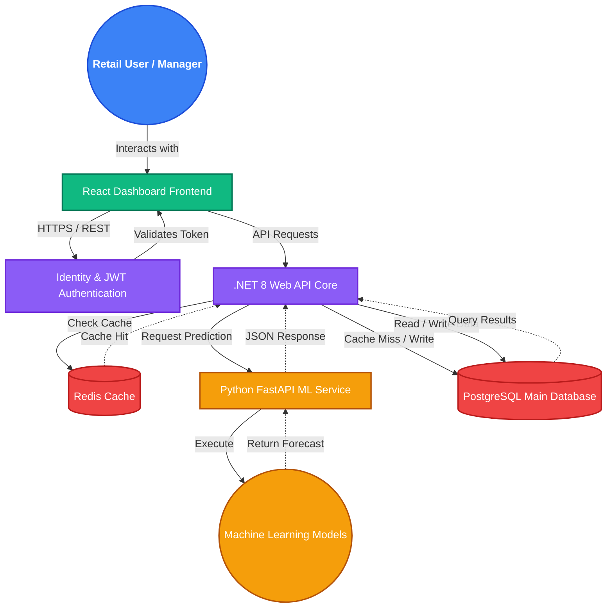
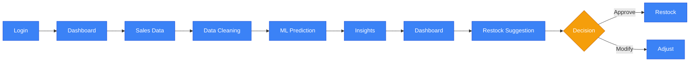
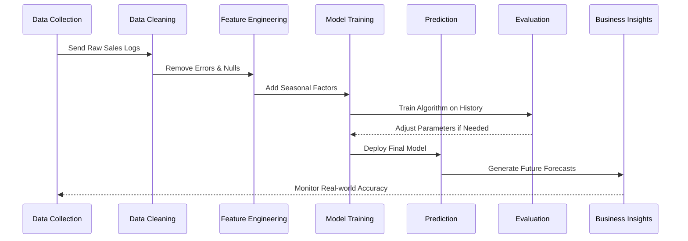

# RetailMind-AI: Enterprise Project Documentation

## 1. Project Overview

**RetailMind-AI** is a comprehensive, enterprise-grade software solution designed to revolutionize how modern retail businesses manage their day-to-day operations. At its core, RetailMind-AI serves as an intelligent operating system that bridges the gap between traditional retail management practices and advanced artificial intelligence.

The primary reason this project was developed is to address the widespread inefficiencies that plague the retail sector. Historically, retail managers and business owners have relied heavily on manual calculations, intuition, and basic spreadsheets to make critical decisions. This manual approach often leads to significant, costly problems:

*   **Inventory Management:** Keeping track of thousands of products is incredibly difficult. Manual tracking often leads to data entry errors and mismatched physical versus digital stock counts.
*   **Demand Forecasting:** Without data-driven insights, businesses struggle to predict what customers will want in the future, making it hard to prepare for seasonal shifts.
*   **Overstocking:** Ordering too much inventory ties up valuable capital. It wastes storage space and often results in perishable goods expiring or seasonal items becoming obsolete.
*   **Stockouts:** Failing to stock enough popular items leads to immediate lost sales. More importantly, it results in dissatisfied customers who may turn to competitors.
*   **Sales Analysis:** Traditional systems often only report *what* sold, lacking the analytical depth to explain *why* it sold or *who* bought it.
*   **Customer Insights:** Understanding purchasing behaviors and demographic trends is nearly impossible without sophisticated data processing tools.
*   **Business Decision Making:** When managers manually crunch numbers, they react to market changes rather than anticipating them, putting the business at a competitive disadvantage.

RetailMind-AI solves these fundamental problems by seamlessly integrating Artificial Intelligence and Data Science directly into the retail workflow. By analyzing historical sales data, current inventory levels, and broader market trends, the system provides actionable, data-driven insights. It shifts the business model from reactive to proactive, empowering retail businesses to operate smarter, faster, and more profitably.

---

## 2. Project Objectives

The development of RetailMind-AI was guided by a set of clear, impactful objectives designed to deliver measurable business value and solve real-world problems.

*   **Improve Inventory Planning:** To eliminate the guesswork from stock management by providing precise, data-backed recommendations on exactly when and how much to restock for every single product category.
*   **Predict Future Demand:** To utilize sophisticated machine learning algorithms to accurately forecast customer demand across different time periods, carefully accounting for historical seasonality and emerging market trends.
*   **Analyze Sales Trends:** To uncover hidden patterns within vast amounts of historical sales data, helping businesses understand which products are performing well, which are underperforming, and how external factors influence purchasing behavior.
*   **Optimize Stock Management:** To maintain the delicate, critical balance between having enough stock to meet customer demand and minimizing excess inventory to free up working capital and valuable warehouse space.
*   **Help Managers Make Data-Driven Decisions:** To provide retail managers and executives with intuitive, easy-to-understand dashboards that translate complex mathematical data into clear, actionable business insights.
*   **Reduce Business Losses:** To actively prevent the financial losses directly associated with both overstocking (unsold goods, spoilage, markdowns) and stockouts (lost revenue, customer churn).
*   **Increase Operational Efficiency:** To automate time-consuming manual processes, such as data entry, inventory counting, and report generation, allowing staff to focus on higher-value tasks like customer service.

---

## 3. Motivation

The primary inspiration behind RetailMind-AI stems from observing the stark contrast between the sophisticated technologies used by global e-commerce giants and the outdated tools still prevalent in traditional physical retail stores. While large online retailers leverage advanced algorithms to optimize every aspect of their supply chain and customer experience, many brick-and-mortar retail businesses still rely heavily on manual decisions, outdated point-of-sale systems, and rudimentary spreadsheets.

This technological gap puts traditional retailers at a significant disadvantage in a highly competitive market. When business decisions are made manually, they are inherently prone to human error, cognitive biases, and a limited ability to process large volumes of data quickly. For instance, a manager might notice that umbrellas sell well when it rains, but they cannot manually calculate the exact correlation between specific weather patterns, the day of the week, and the specific brand of umbrella that yields the highest profit margin.

We recognized that bringing Artificial Intelligence and advanced analytics to the physical retail space could dramatically level the playing field. Intelligent retail systems are becoming absolutely essential in modern businesses because the margin for error is shrinking rapidly. Operating costs are continually rising, and consumer expectations for product availability are higher than ever. RetailMind-AI was motivated by the desire to democratize these powerful technologies, packaging complex data science capabilities into a user-friendly application that any retail manager can use to transform their business.

---

## 4. Key Features

RetailMind-AI is built with a robust suite of features, each carefully designed to tackle specific retail challenges in a user-friendly manner.

*   **Dashboard:** A centralized, highly visual command center that gives managers an immediate, real-time overview of the business's health, including daily sales, active alerts, and quick performance metrics.
*   **Demand Forecasting:** An intelligent prediction engine that anticipates future product sales based on historical data, helping the business prepare for upcoming weeks or months with high accuracy.
*   **Inventory Optimization:** A dynamic system that constantly monitors stock levels, automatically calculating the perfect reorder points to ensure shelves are never empty but backrooms are never over-stuffed.
*   **Sales Analytics:** A deep-dive analytical tool that breaks down revenue streams, highlighting top-selling items, underperforming categories, and identifying exactly where profits are originating.
*   **Customer Analytics:** A feature that analyzes purchasing patterns to understand customer behavior, segmenting shoppers based on their buying habits to inform targeted marketing and stocking strategies.
*   **Product Performance Analysis:** A detailed tracking system that evaluates individual product lifecycles, helping managers decide which products to heavily promote, gently discount, or discontinue entirely.
*   **Business Reports:** An automated engine that generates comprehensive, professional reports on a daily, weekly, or monthly basis, summarizing critical financial and operational metrics for stakeholders.
*   **AI Recommendations:** Proactive, system-generated suggestions that advise managers on specific actions, such as recommending a discount to clear aging stock or suggesting an increase in order volume ahead of a busy season.
*   **Predictive Analytics:** Beyond just forecasting product demand, this feature predicts broader business trends, such as expected overall foot traffic or the potential financial impact of a new promotional campaign.
*   **Authentication:** A secure, robust login system utilizing industry standards that ensures only authorized personnel can access the platform and view sensitive company data.
*   **Role-Based Access:** A hierarchical permission system that ensures cashiers only see what they need for basic sales, while managers and executives have access to sensitive financial reports and strategic AI tools.
*   **Data Visualization:** The translation of complex data sets into beautiful, easy-to-understand interactive charts, graphs, and heatmaps, making data science accessible to non-technical users.
*   **Responsive User Interface:** A modern, flexible design that ensures the application works seamlessly and looks beautiful on desktop computers in the back office, as well as on tablets on the shop floor.
*   **Admin Dashboard:** A specialized, restricted control panel for system administrators to easily manage user accounts, configure core system settings, and monitor the overall technical health of the application.
*   **Report Generation:** A flexible export tool allowing users to easily generate and download custom reports in various formats like PDF or Excel for easy sharing, printing, and offline analysis.

---

## 5. Technology Stack

To build a secure, scalable, and highly performant enterprise application, we carefully selected a modern technology stack. Each technology was chosen for its specific strengths in handling the demanding requirements of a data-intensive platform.

| Technology | Purpose |
| :--- | :--- |
| **React 19** | Used to build a dynamic, fast, and interactive user interface. It allows us to create reusable UI components, ensuring a smooth and responsive user experience. |
| **TypeScript** | Adds strict type-checking to our JavaScript code. This prevents countless potential bugs during development, making the frontend highly reliable and easier to maintain. |
| **Vite** | Serves as our frontend build tool. Vite provides incredibly fast startup times and hot module replacement, which drastically speeds up the development process. |
| **Tailwind CSS** | A utility-first styling framework that allows us to rapidly build custom, responsive designs. It ensures the application looks modern and professional across all devices. |
| **Recharts** | A specialized charting library built for React. We selected it to create the beautiful, interactive data visualizations required for the analytics dashboards. |
| **Framer Motion** | Used to add smooth, professional animations to the user interface. These subtle animations make the application feel more polished and user-friendly. |
| **.NET 8 Web API** | The core framework for our main server. Chosen for its exceptional performance, enterprise-grade security features, and excellent support for building robust RESTful APIs. |
| **C#** | The primary programming language for our backend. C# is strongly typed and highly efficient, making it ideal for handling complex business logic securely. |
| **Entity Framework Core** | An Object-Relational Mapper (ORM) that allows our backend to communicate seamlessly with the database using C# objects, speeding up development and improving security. |
| **ASP.NET Identity** | Provides a comprehensive system for managing users, passwords, and roles. It ensures our application meets industry standards for secure authentication. |
| **JWT Authentication** | JSON Web Tokens are used to securely transmit information between the frontend and backend, ensuring that every request made to the server is verified and authorized. |
| **Python FastAPI** | A modern, high-performance web framework for Python. Used specifically to host our Machine Learning models as microservices for rapid predictions. |
| **Scikit-Learn** | A powerful Python library used for building our foundational predictive models. It provides the essential algorithms required for tasks like regression and demand forecasting. |
| **Pandas & NumPy** | Essential tools for data manipulation and numerical computation. Used to clean, structure, and process the raw retail data before feeding it into our AI models. |
| **Matplotlib** | Used during the development phase by our data scientists to visualize data distributions and evaluate model performance before deploying them to production. |
| **Demand Forecasting Models**| Custom-trained machine learning algorithms designed specifically to analyze historical sales data and predict future purchasing trends accurately. |
| **Delivery Time Prediction** | Specialized models designed to estimate how long it will take for supplier orders to arrive, further optimizing the inventory restocking process. |
| **PostgreSQL** | A highly robust, open-source relational database. Selected for its reliability, data integrity, and ability to handle complex queries efficiently for sales and inventory data. |
| **Redis** | An in-memory data store used for caching frequently accessed information. Redis drastically reduces dashboard load times and takes pressure off the primary database. |
| **Docker & Docker Compose**| Containerization tools that package our application and its dependencies into standardized units, ensuring consistent performance across all environments. |
| **Git & GitHub** | Used for tracking code changes, collaborating across the development team, and maintaining a secure, organized history of the project's entire evolution. |

---

## 6. System Architecture

RetailMind-AI employs a modern, microservices-oriented architecture designed for maximum scalability, security, and separation of concerns. By dividing the system into distinct, specialized components, we ensure that the application is capable of handling heavy data loads efficiently.

**Architecture Flow Summary:**
The user interacts with the React frontend, which communicates securely via JWT tokens with the .NET 8 backend. The .NET backend acts as the central orchestrator, handling all standard business logic and interacting directly with the PostgreSQL database. To ensure high performance, frequently requested data is cached in Redis. When complex AI predictions are needed, the .NET backend makes a rapid internal API call to the Python FastAPI microservice, which executes the Machine Learning models and returns predictive insights back to the user interface.

---

## 7. Project Workflow

The daily operation of RetailMind-AI is designed to be highly intuitive, seamlessly transforming raw retail data into actionable business intelligence with minimal effort required from the human user.

**Step-by-Step Workflow Explanation:**
1.  **User Login:** The retail manager securely logs into the platform using role-based credentials.
2.  **Dashboard:** The user is immediately greeted by a high-level visual overview of current store performance.
3.  **Retrieve Sales Data:** Behind the scenes, the system continuously aggregates the latest sales and inventory records from the database.
4.  **Data Processing:** The backend automatically organizes, structures, and cleans this data, preparing it for complex analysis.
5.  **Machine Learning Prediction:** The prepared data is sent to the AI service, which runs predictive algorithms to forecast future demand trends.
6.  **Generate Business Insights:** The system translates these complex mathematical predictions into easily understandable business insights.
7.  **Dashboard Visualization:** These insights are rendered into beautiful, interactive charts and graphs on the user's screen.
8.  **Inventory Recommendation:** The AI explicitly recommends concrete actions, such as suggesting exactly how many units of a product to reorder.
9.  **Manager Decision:** The human manager reviews the AI's recommendation and uses their expertise to make the final purchasing decision.

---

## 8. Machine Learning Pipeline

The core intelligence of RetailMind-AI relies on a rigorous, automated Data Science and Machine Learning pipeline. This is the sequential process where raw, unorganized retail data is refined into highly valuable predictive intelligence.

**Pipeline Stages Explained:**
1.  **Data Collection:** The system aggregates years of historical sales records, product catalogs, and inventory logs directly from the primary database.
2.  **Data Cleaning:** Real-world retail data is often incomplete or messy. The pipeline automatically removes duplicate entries, handles missing values, and corrects formatting errors to ensure accuracy.
3.  **Feature Engineering:** This is a critical step where data scientists create new variables to give the AI context. For example, identifying whether a sales date fell on a major holiday significantly helps the AI understand sudden sales spikes.
4.  **Model Training:** The cleaned and engineered data is fed into machine learning algorithms. The AI analyzes this history to learn the hidden mathematical patterns of customer purchasing behavior.
5.  **Prediction:** Once properly trained, the model is provided with current data and asked to forecast what will happen in the near future.
6.  **Evaluation:** The system constantly tests the model's predictions against actual, real-world outcomes to ensure ongoing accuracy.
7.  **Business Insights:** Finally, the numerical predictions are translated into plain-English business recommendations displayed on the manager's dashboard.

---

## 9. Database Design

A solid, well-structured relational database design is the absolute backbone of RetailMind-AI. We utilize PostgreSQL to ensure that all business data is stored securely, related logically, and retrievable instantly.

### Core Database Tables

| Table Name | Description | Key Relationships |
| :--- | :--- | :--- |
| **Users** | Stores essential employee information, secure login credentials, and contact details. | Linked to `Roles` to determine access levels. |
| **Roles** | Defines the various permission levels within the system (e.g., Admin, Manager, Cashier). | Linked to `Users` to enforce security policies. |
| **Products** | The master catalog of all items sold in the store. Includes pricing, categories, and SKU codes. | The central hub linked to `Inventory`, `Sales`, and `Orders`. |
| **Inventory** | Tracks the current, real-time stock levels of every product physically present in the store. | Linked directly to `Products`. |
| **Sales** | Records the details of every individual transaction that occurs, including timestamps and quantities. | Linked to `Products` (items sold) and `Users` (cashier). |
| **Orders** | Logs purchase orders made to external suppliers to restock inventory levels. | Linked to `Products` being ordered. |
| **Forecast Results** | Stores the historical predictions generated by the Machine Learning models for ongoing accuracy tracking. | Linked to `Products` to track item-specific forecasts. |
| **Reports** | Saves customized business reports generated by managers for future reference or auditing. | Linked to `Users` who generated the report. |
| **Authentication** | Stores secure, encrypted password hashes and active JWT token validation data. | Securely linked to the `Users` table. |

**Relationship Overview:** The database is highly relational to maintain data integrity. When a `User` (Cashier) processes a `Sale`, the transaction references specific `Products`. That sale automatically triggers an update in the `Inventory` table to reduce stock. Concurrently, the Machine Learning models pull historical data from the `Sales` table to generate new predictions stored in `Forecast Results`, which ultimately helps a `User` (Manager) create new supplier `Orders`.

---

## 10. AI & Data Science Components

RetailMind-AI transforms a standard digital ledger into an intelligent business assistant through the integration of several core Data Science components.

*   **Demand Forecasting:** This is the flagship AI feature. By analyzing past sales volumes, seasonality, and emerging trends, the system mathematically predicts exactly how many units of a specific product will sell in the upcoming timeframe.
*   **Sales Prediction:** Similar to product forecasting, this component looks at the broader financial picture, predicting total store revenue or departmental revenue, significantly aiding in overall financial planning.
*   **Trend Analysis:** The system automatically identifies emerging, non-obvious patterns. For example, it might detect that sales of specific snack items correlate strongly with local sporting events, allowing managers to optimize inventory proactively.
*   **Business Intelligence:** We transform raw database tables into strategic knowledge by continuously calculating Key Performance Indicators (KPIs) like average transaction value, customer acquisition cost, and profit margins per product category.
*   **Data Visualization:** Because human brains process visual information much faster than raw numbers, our data science components rely heavily on advanced charting libraries to make complex statistical outputs immediately understandable at a glance.
*   **Predictive Analytics:** This involves using AI to answer complex "What if?" questions, helping managers scientifically assess risks before making major purchasing or promotional decisions.
*   **Recommendation Engine:** Operating similarly to how streaming services recommend movies, our engine recommends concrete business actions, advising managers exactly when and what to order to prevent predicted stockouts.

These components fundamentally shift the paradigm of retail management from a reactive guessing game to a proactive, scientifically-driven operational strategy.

---

## 11. Challenges Faced & Solutions

Developing a complex, enterprise-grade AI system presents numerous significant technical and architectural challenges. Here is an overview of the major hurdles faced and how they were successfully resolved:

*   **Handling Large Datasets:**
    *   *Challenge:* Retail businesses generate massive amounts of transactional data daily. Querying years of this sales history was causing the dashboard to load unacceptably slowly.
    *   *Solution:* We implemented strategic database indexing on frequently searched columns in PostgreSQL. Furthermore, we introduced **Redis** for in-memory caching. Now, common dashboard metrics load instantly from the cache rather than querying the main database on every page refresh.
*   **Choosing Prediction Models:**
    *   *Challenge:* Standard, simple linear regression models were failing to capture the complex, highly seasonal nature of retail sales (e.g., massive spikes during holiday seasons).
    *   *Solution:* We evaluated multiple algorithms and implemented more advanced time-series forecasting models that specifically account for seasonality and non-linear trends, which drastically improved the overall prediction accuracy.
*   **API Communication Latency:**
    *   *Challenge:* Calling the Python Machine Learning service from the .NET backend occasionally caused timeouts during periods of heavy data processing.
    *   *Solution:* We optimized the FastAPI endpoints, implemented asynchronous processing, and ensured that data was heavily pre-processed locally in .NET before being sent to Python, significantly reducing payload size and network transit time.
*   **Data Preprocessing Realities:**
    *   *Challenge:* Real-world data is inherently messy. Missing values, manual entry errors, and negative sales (returns) were regularly breaking the machine learning training pipeline.
    *   *Solution:* We built a robust, automated data cleaning pipeline using Pandas that automatically handles anomalies, imputes missing values intelligently based on historical averages, and normalizes the data before it reaches the AI models.
*   **Dashboard Performance:**
    *   *Challenge:* Rendering complex, interactive charts with thousands of individual data points was causing the React frontend to stutter and consume too much memory in the browser.
    *   *Solution:* We utilized data aggregation techniques on the backend, ensuring the frontend only receives summarized data points necessary for visualization, keeping the user interface incredibly smooth and responsive.
*   **Secure Authentication & Deployment:**
    *   *Challenge:* Ensuring enterprise-level security while managing a complex multi-container deployment environment.
    *   *Solution:* We implemented robust JWT authentication for security. For deployment, we heavily utilized Docker and Docker Compose to ensure that the frontend, backend, AI service, and databases all run consistently and reliably across any environment.

---

## 12. Future Enhancements

While RetailMind-AI is currently a highly capable platform, we maintain a clear, ambitious roadmap for future innovation to make the system even more intelligent and expansive:

*   **Deep Learning Models:** Upgrading from traditional machine learning to advanced neural networks to capture even more nuanced, complex purchasing patterns hidden deep within the data.
*   **Real-Time Analytics:** Enhancing the data pipeline to process and visualize sales data with sub-second latency, providing a truly live view of store operations.
*   **Computer Vision for Retail:** Integrating with existing store security cameras to analyze customer foot traffic patterns, generating physical heatmaps to optimize store layouts and product placement.
*   **AI Chat Assistant:** Implementing a natural language AI chatbot directly within the dashboard, allowing managers to simply type questions like, "What were our top-selling electronics last Tuesday?" and receive instant answers.
*   **Customer Behavior Prediction:** Moving beyond aggregate product forecasting to predict individual customer churn rates and lifetime value, enabling highly personalized marketing campaigns.
*   **Recommendation System:** Developing a customer-facing recommendation engine that can be integrated into digital receipts or loyalty apps to suggest complementary products.
*   **Mobile Application:** Developing a dedicated, native mobile application for iOS and Android, allowing managers to receive instant push notifications about critical stock alerts while walking the shop floor.
*   **IoT Integration:** Connecting the software directly with smart shelves and RFID tags for 100% automated, real-time inventory tracking, eliminating the need for manual stock counting entirely.
*   **Cloud Deployment & Multi-Store Management:** Scaling the cloud architecture to allow enterprise executives to compare performance and manage inventory across dozens of retail locations from a single, unified global dashboard.
*   **Voice Assistant & Predictive Purchasing:** Enabling voice-activated commands for hands-free operation and allowing the system to automatically draft and send purchase emails to suppliers when stock reaches critical thresholds.

---

## 13. Learning Outcomes

The end-to-end development of RetailMind-AI was a profound technical journey that bridged the gap between theoretical computer science and practical enterprise software engineering. Key learning outcomes include:

*   **Artificial Intelligence & Machine Learning:** Gained deep, practical experience in transitioning raw, messy data into trained, predictive machine learning models using Python, Scikit-Learn, and Pandas in a production environment.
*   **Data Science:** Developed a strong understanding of how to extract meaningful business insights from vast datasets and how to communicate those insights effectively through data visualization.
*   **React Development:** Mastered building complex, state-heavy frontend applications using React 19, TypeScript, and modern styling frameworks to create enterprise-grade user interfaces.
*   **.NET Backend & FastAPI:** Learned how to design and build a scalable microservices architecture, successfully integrating a high-performance .NET core backend with a specialized Python AI service.
*   **Cloud Development & REST APIs:** Deepened understanding of secure RESTful API development, cross-service communication, and cloud-ready architectural principles.
*   **Database Design:** Acquired hands-on experience in designing complex relational database schemas in PostgreSQL and utilizing Redis caching to solve real-world performance bottlenecks.
*   **Docker, Git & GitHub:** Mastered essential DevOps practices, learning the critical importance of containerization with Docker and robust version control for collaborative enterprise development.
*   **Software Architecture:** Developed the ability to design systems that are not only functional but also scalable, secure, and maintainable over the long term.
*   **Enterprise Development & Problem Solving:** Cultivated the invaluable ability to view technical challenges through a business lens, ensuring that every line of code ultimately serves to solve a real-world operational problem.

---

## 14. Conclusion

**RetailMind-AI** represents the successful, practical convergence of advanced Data Science, Machine Learning, and modern Enterprise Software Engineering. By taking complex, algorithmic intelligence and wrapping it in an intuitive, highly accessible user interface, this project provides a definitive solution to some of the most persistent and costly challenges in the retail industry.

The system conclusively proves that data-driven decision-making shouldn't be restricted to massive e-commerce corporations with unlimited tech budgets. Through accurate demand forecasting, automated inventory optimization, and deep sales analytics, RetailMind-AI empowers traditional retail managers to dramatically reduce waste, increase profitability, and operate with unprecedented efficiency.

Beyond its immediate, tangible feature set, this project serves as a comprehensive demonstration of advanced full-stack development capabilities, rigorous problem-solving skills, and thoughtful architectural design. It highlights the immense future potential for digital transformation within the traditional retail sector, proving unequivocally that when Artificial Intelligence is applied thoughtfully to daily business operations, the results are genuinely transformative.
