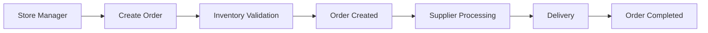
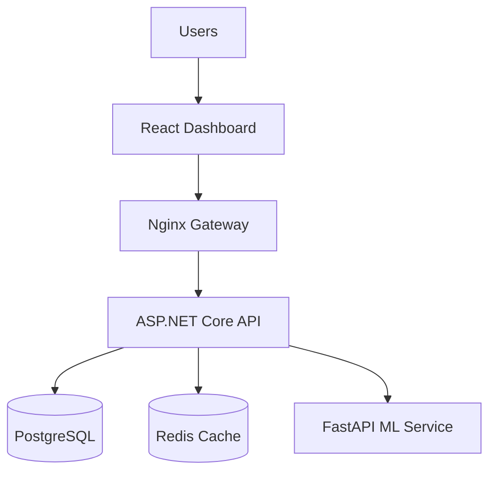
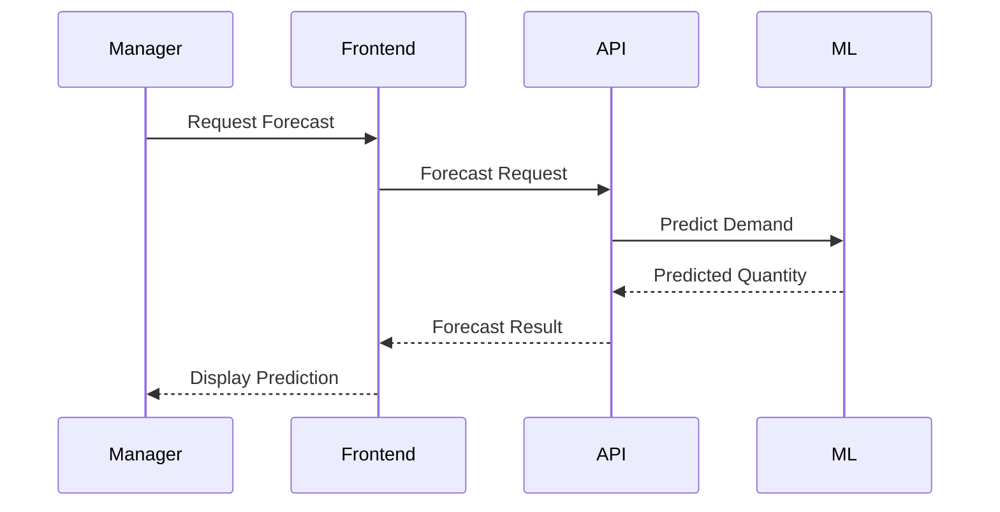
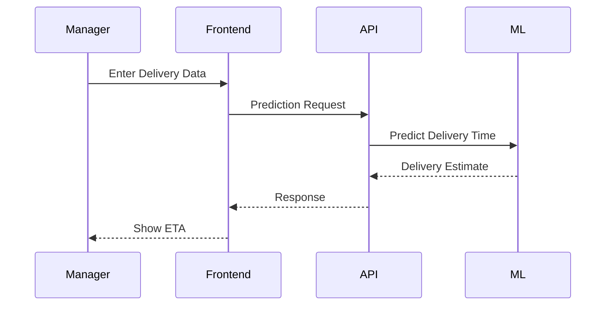

# 🏪 RetailMind AI

> **An AI-Powered Retail & Supply Chain Optimization Platform**

RetailMind AI is a production-grade enterprise platform designed to help retail businesses manage inventory, orders, employees, logistics, and demand forecasting through Artificial Intelligence, Machine Learning, and real-time analytics.

---

# 🌟 The Problem

Modern retail businesses face several daily challenges:

## 📦 Inventory Problems

* Products run out of stock unexpectedly.
* Customers cannot find products they need.
* Sales opportunities are lost.

## 🗑️ Overstocking Problems

* Too many products are purchased.
* Perishable items expire.
* Inventory costs increase.

## 🚚 Logistics Problems

* Delivery delays affect store operations.
* Traffic and weather conditions are unpredictable.
* Managers cannot estimate delivery times accurately.

## 👨‍💼 Workforce Problems

* Employee schedules become difficult to manage.
* Overtime tracking is inconsistent.
* Workforce planning becomes inefficient.

## 📈 Demand Planning Problems

* Future demand is difficult to predict.
* Managers rely on guesswork.
* Incorrect forecasting causes losses.

---

# 💡 The Solution

RetailMind AI acts as a centralized intelligence platform for retail businesses.

Instead of using multiple disconnected systems, managers can use one platform to:

✅ Monitor inventory

✅ Manage orders

✅ Track employees

✅ Predict future demand

✅ Forecast delivery times

✅ Analyze business performance

---

# 👥 Target Users

## 🏢 Store Managers

* Monitor inventory levels
* Place orders
* Track deliveries
* View analytics

## 👨‍💼 Employees

* View work schedules
* Track work logs
* Update inventory records

## 🚚 Suppliers / Vendors

* Receive purchase requests
* Manage deliveries

## 👑 Administrators

* Manage the entire platform
* Configure users and roles
* Monitor company-wide performance

---

# 🚀 Core Features

---

## 📦 Inventory Management

### Problem

Managers often discover inventory shortages too late.

### Solution

RetailMind AI automatically monitors stock levels.

When inventory falls below a predefined threshold:

```text
Milk Stock = 5
Minimum Threshold = 10

⚠ Low Stock Alert
```

Managers receive alerts and can replenish inventory before stockouts occur.

---

## 🛒 Order Management

### Features

* Create Orders
* Track Orders
* Pre-Order Scheduling
* Order Status Monitoring

### Order Flow



---

## 🤖 AI Demand Forecasting

### Goal

Predict future product demand.

### Inputs

* Historical Sales
* Product Price
* Seasonality
* Promotions
* Day of Week

### Example

```text
Current Weekly Sales = 500

AI Forecast:
Expected Next Week Sales = 650
```

### Benefits

* Reduce stockouts
* Reduce overstocking
* Improve purchasing decisions

---

## 🚚 AI Delivery Time Prediction

### Goal

Predict delivery duration and logistics risk.

### Inputs

* Distance
* Order Volume
* Traffic Conditions
* Weather Conditions

### Example

```text
Distance = 50km
Traffic = High
Weather = Rainy

Predicted Delivery Time:
75 Minutes
```

### Benefits

* Better planning
* Reduced delays
* Improved customer satisfaction

---

## 👨‍💼 Employee Management

### Features

* Employee Records
* Work Logs
* Overtime Tracking
* Role-Based Access

### Example

```text
Employee:
John Smith

Hours Worked:
52

Overtime:
12 Hours
```

---

## 📊 Analytics Dashboard

RetailMind AI provides a centralized dashboard for decision makers.

### Dashboard Metrics

* Total Sales
* Total Orders
* Inventory Status
* Low Stock Alerts
* Demand Forecasts
* Delivery Predictions

---

# 🏛️ System Architecture

## High-Level Architecture



---

# 🔄 Demand Forecast Workflow



---

# 🚚 Delivery Prediction Workflow



---

# 🛠️ Technology Stack

| Layer          | Technology             |
| -------------- | ---------------------- |
| Frontend       | React 19 + TypeScript  |
| Backend        | ASP.NET Core 8         |
| Database       | PostgreSQL             |
| Cache          | Redis                  |
| ML Service     | FastAPI                |
| ML Models      | Scikit-Learn           |
| Infrastructure | Docker                 |
| Gateway        | Nginx                  |
| Testing        | xUnit + Moq            |
| Logging        | Serilog                |
| Authentication | JWT + ASP.NET Identity |

---

# 📂 Project Structure

```text
RetailMind-AI/

├── src/
│   ├── RetailMind.API/
│   └── RetailMind.Web/

├── python_api/

├── models/

├── datasets/

├── nginx/

├── tests/

├── docker-compose.yml

└── README.md
```

---

# 🔐 Security Features

* JWT Authentication
* Role-Based Access Control
* Password Hashing
* Rate Limiting
* Security Headers
* Correlation ID Tracking
* Secure API Communication

---

# 🧪 Testing Strategy

### Frameworks Used

* xUnit
* Moq
* FluentAssertions
* EF Core InMemory

### Tested Modules

#### Order Service

* Order Creation
* Stock Validation
* Authorization Checks

#### Inventory Service

* Inventory Retrieval
* Low Stock Detection
* Product Validation

### Results

| Metric      | Result |
| ----------- | ------ |
| Total Tests | 6      |
| Passed      | 6      |
| Failed      | 0      |

---

# 📈 Business Benefits

RetailMind AI helps businesses:

✅ Reduce stockouts

✅ Minimize inventory waste

✅ Improve delivery planning

✅ Optimize workforce management

✅ Make data-driven decisions

✅ Increase operational efficiency

---

# 🎯 Future Enhancements

* Multi-store management
* Real-time IoT integration
* Mobile application
* AI recommendation engine
* Predictive workforce planning
* Cloud-native Kubernetes deployment

---

# 👨‍💻 Developer

**Manvith Kumar**

Final Year Computer Science & Artificial Intelligence Engineering Student

Focused on:

* Enterprise Software Engineering
* Artificial Intelligence
* Cloud Computing
* Japanese IT Careers

---

# 🏁 Conclusion

RetailMind AI is more than a retail management system.

It is an AI-powered decision support platform that combines enterprise software engineering, machine learning, cloud-native architecture, and modern web technologies to help retail businesses operate more efficiently and intelligently.
