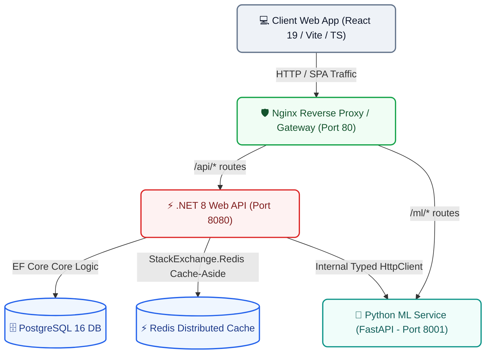

# <p align="center"><br>RetailMind AI</p>

<p align="center">
  <strong>An Enterprise-Grade, AI-Powered Retail & Supply Chain Optimization Platform</strong>
</p>

<p align="center">
  <a href="#-architecture"></a>
  <a href="src/RetailMind.API/"></a>
  <a href="src/RetailMind.Web/"></a>
  <a href="python_api/"></a>
  <a href="#-tech-stack"></a>
  <a href="TESTING.md"></a>
</p>

---

## 🌟 Introduction

**RetailMind AI** is a state-of-the-art, production-grade enterprise platform designed to solve modern commerce challenges: inventory stockouts, inefficient replenishment, supply chain bottlenecks, and volatile sales demand. 

By combining a robust **.NET 8 Clean Architecture backend**, a high-performance **React 19 + TypeScript frontend dashboard**, and a native **FastAPI Machine Learning microservice**, RetailMind AI provides retail operators with predictive intelligence and real-time operations control in a secure, containerized topology.

---

## 🚀 Key Platform Features

### 🛒 Inventory & Order Management Engine
* **Atomic Stock Deduction**: Secure transaction boundary guarantees inventory is atomically reconciled when orders are placed, eliminating race conditions and over-selling.
* **Low-Stock Alerting**: High-performance category tracking with active triggers to alert personnel when inventory drops below safety thresholds (`IsLowStock`).
* **Role-Based Workforces**: Clean management of employees, assignments, permissions, and active store responsibilities.

### 🧠 Predictive Machine Learning Engine
* **Demand Forecasting**: Custom Random Forest regression pipeline serving native predictions in Python. Generates estimated future sales volume based on product SKUs, temporal seasonality, target price, and active promotion status.
* **Logistics & Delivery SLA Estimations**: Gradient Boosting regressor predicting transit durations (in minutes) and classifying Transit SLA risk levels (`Met` vs. `At Risk`) using route distance, volume size, weather forecasts, and current traffic density.
* **Typed C# Clients**: Resilient .NET `HttpClient` services mapping C# requests cleanly to Python FastAPI inference pipelines with custom validation schemas.

### 🔒 Enterprise Security & Stability Layers
* **ASP.NET Core Identity**: Strict password configurations, email uniqueness validation, and account lockout security rules safeguarding brute-force attempts.
* **JWT Access & Refresh Token Rotation**: Secure token management with refresh token storage in PostgreSQL and stateful revocation to manage concurrent active sessions.
* **Global Security Middleware**:
  - Global injection of **HSTS, X-Content-Type-Options, X-Frame-Options, Content Security Policy (CSP), and XSS protection**.
  - **Correlation ID Tracking** (`X-Correlation-Id`) propagated across middleware, console logs, file logs, and sub-services for trace visualization.
  - Comprehensive custom **Rate Limiting** via ASP.NET Core rate limit middleware.

### ⚡ Performance & Reliability
* **Cache-Aside Redis Layer**: Integrates distributed caching to speed up high-traffic reads (e.g., product catalog, forecasting parameters) using standard cache invalidation triggers.
* **Nginx API Gateway**: Unified entry point for all frontend client traffic, handling route isolation, security hardening, and path stripping for the microservice mesh.

---

## 🏛️ System Architecture

RetailMind AI relies on a microservices mesh coordinated via **Docker Compose** and unified through an **Nginx Reverse Proxy / Gateway**.



---

## 🛠️ Technology Stack

| Service Boundary | Technology | Primary Libraries / Packages Used |
| :--- | :--- | :--- |
| **Frontend Web** | React 19 (TypeScript) + Vite | TailwindCSS v4, Recharts, Framer Motion, React Router v7, React Hook Form, Zod, Axios, Lucide React, Sonner |
| **Backend Core** | .NET 8.0 (C# 12) Web API | Entity Framework Core, ASP.NET Core Identity, Npgsql.EntityFrameworkCore.PostgreSQL, MicroElements.Swashbuckle.FluentValidation, Serilog, AutoMapper, Microsoft.Extensions.Caching.StackExchangeRedis |
| **Machine Learning**| Python 3.11 (FastAPI) | Scikit-Learn, Pandas, NumPy, Joblib, Uvicorn, Pydantic |
| **Infrastructure** | Docker, Nginx, Linux Containers | PostgreSQL 16 Alpine, Redis 7 Alpine, Nginx 1.27 Alpine |

---

## 📂 Repository Structure

```text
RetailMind-AI/
├── .github/                  # CI/CD workflows and automated testing suites
├── datasets/                 # Raw/synthesized CSV datasets used for training ML models
│   ├── delivery_prediction.csv
│   └── demand_forecasting.csv
├── models/                   # Serialized production ML models (.joblib binaries)
│   ├── demand_rf_model.joblib
│   └── delivery_gb_model.joblib
├── nginx/                    # Reverse Proxy Nginx Gateway configuration
│   └── nginx.conf
├── python_api/               # Python microservice containing forecasting inference endpoints
│   ├── main.py               # FastAPI server entry point, pipelines, and schema validation
│   └── requirements.txt      # Python dependencies
├── scripts/                  # Automated dataset synthesis and scikit-learn model training
│   ├── generate_datasets.py  # Generates realistic synthetic retail logs
│   ├── train_demand_model.py # Trains the Random Forest Demand Forecast regressor
│   └── train_delivery_model.py# Trains the Gradient Boosting Route Predictor
├── src/                      # Core Web & API source code
│   ├── RetailMind.API/       # .NET 8 Web API implementing Clean Architecture
│   │   ├── Controllers/      # ASP.NET Core REST API Endpoints
│   │   ├── Data/             # EF Core DbContext, Migrations, and seeders
│   │   ├── DTOs/             # Unified request/response positional records
│   │   ├── Repositories/     # High-performance persistence layer (Order/Inventory)
│   │   ├── Services/         # Orchestrates core business algorithms and ML typed clients
│   │   ├── Middleware/       # Security headers, Correlation IDs, request profiling
│   │   └── Program.cs        # Service configuration & dependency injection setup
│   └── RetailMind.Web/       # Vite-powered SPA React 19 Frontend
│       ├── src/
│       │   ├── components/   # UI elements (charts, inventory, employee cards)
│       │   ├── pages/        # Dashboard, Insights, Orders, Inventory pages
│       │   └── services/     # API request hooks and security integrations
├── tests/                    # Quality Assurance test suite
│   └── RetailMind.Tests/     # Core C# unit & integration tests (xUnit + Moq)
├── docker-compose.yml        # Orchestration profile mapping all system boundaries
└── README.md                 # Primary system manual
```

---

## 🏁 Getting Started

### 📋 Prerequisites
Ensure the following tools are installed on your host system:
* [Docker Desktop](https://www.docker.com/products/docker-desktop/) (includes Docker Compose)
* [.NET 8 SDK](https://dotnet.microsoft.com/en-us/download/dotnet/8.0) (optional, for local development)
* [Node.js v20+](https://nodejs.org/) (optional, for local frontend run)
* [Python 3.11+](https://www.python.org/) (optional, for local model training)

---

### 🐳 Run the System (Docker-Compose)

The entire platform—including backend APIs, databases, caches, gateway proxies, and ML pipelines—can be spun up with a single CLI command from the repository root:

```bash
# Clone the repository
git clone https://github.com/Manvith-kumar16/RetailMind-AI.git
cd RetailMind-AI

# Spin up all containers in detached mode
docker-compose up --build -d
```

#### Service Endpoints (Container Mesh)

Once running, the reverse proxy routes traffic through standard ports on `localhost`:

* **Client Dashboard (Web SPA)**: `http://localhost` (via Nginx proxying)
* **Backend API Swagger**: `http://localhost/swagger` (Interactive API documentation)
* **Python FastAPI Docs**: `http://localhost/docs` (Machine learning API specifications)
* **System Health Check**: `http://localhost/health` (Checks DB and core service bounds)

---

### 🛠️ Run the System (Local Development)

If you prefer to run services individually outside of containers:

#### 1. Setup Databases
Spin up PostgreSQL and Redis inside Docker so you have active development backends:
```bash
docker run --name retailmind_postgres -p 5432:5432 -e POSTGRES_DB=RetailMindDB -e POSTGRES_USER=postgres -e POSTGRES_PASSWORD=postgres_dev_password -d postgres:16-alpine
docker run --name retailmind_redis -p 6379:6379 -d redis:7-alpine
```

#### 2. Run Python ML Service
```bash
cd python_api
python -m venv venv
# Windows:
.\venv\Scripts\activate
# Unix/macOS:
source venv/bin/activate

pip install -r requirements.txt
python main.py
```
*API will run directly at `http://localhost:8000` (docs available at `http://localhost:8000/docs`).*

#### 3. Run .NET 8 API
Configure migrations and launch:
```bash
cd src/RetailMind.API
# Generate migrations and update database
dotnet ef database update

# Run the API
dotnet run
```
*API will run at `http://localhost:5254` (Swagger available at `http://localhost:5254/index.html`).*

#### 4. Run React 19 Frontend
```bash
cd src/RetailMind.Web
npm install
npm run dev
```
*Vite local development server launches at `http://localhost:5173`.*

---

## 🔒 Default Credentials

On startup, RetailMind AI seeds the database with roles and a default system administrator for rapid testing:

* **Default Admin Email**: `admin@retailmind.ai`
* **Default Admin Password**: `Admin@123456!`

> [!WARNING]
> **Production Hardening**: Ensure you override the default credentials in production environments using Docker secrets, environment variables, or a dedicated key store (e.g., Azure Key Vault).

---

## 🛡️ Testing & QA

RetailMind AI features a comprehensive QA verification harness, maintaining robust standards for business-critical logic. For full details on tests, coverage, and the automated CI/CD pipeline, please refer to the detailed [TESTING.md](TESTING.md).

To run the xUnit backend test suite locally:
```bash
dotnet test RetailMind.sln
```

---

## 👨‍💻 Contributing

1. **Fork** the repository.
2. Create your feature branch (`git checkout -b feature/NewFeature`).
3. Commit your changes (`git commit -m 'Add NewFeature'`).
4. Push to the branch (`git push origin feature/NewFeature`).
5. Open a **Pull Request**.

---

## 📄 License
This project is licensed under the MIT License - see the `LICENSE` file for details (if applicable).

---

## 🚀 Quick Start (Frontend & Backend)

If you want to quickly start just the frontend and backend locally (without Docker), you can run these commands in separate terminal windows:

**1. Start the Backend (.NET 8 API)**
```bash
cd src/RetailMind.API
export ASPNETCORE_ENVIRONMENT=Development
dotnet run
```
*The API and Swagger UI will be available at `http://localhost:5000` (or `http://localhost:5254`)*

**2. Start the Frontend (React 19 / Vite)**
```bash
cd src/RetailMind.Web
npm install
npm run dev
```
*The frontend dashboard will be available at `http://localhost:5173`*
