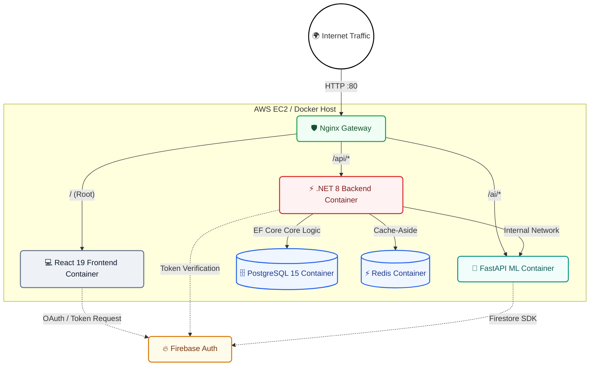

# <p align="center"><br>RetailMind AI</p>

<p align="center">
  <strong>An Enterprise-Grade, AI-Powered Retail & Supply Chain Optimization Platform</strong>
</p>

<p align="center">
  <a href="http://13.232.48.137"></a>
  <a href="#-architecture"></a>
  <a href="Backend/"></a>
  <a href="Frontend/"></a>
  <a href="AI-Service/"></a>
  <a href="#-tech-stack"></a>
</p>

---

## 🌍 Live Production Deployment

**RetailMind AI is fully deployed and running in production on AWS EC2.**  
👉 **[View Live Demo: http://13.232.48.137](http://13.232.48.137)**

*(Note: If you are testing the live deployment, please use the public sign-up or the default credentials below)*

---

## 🌟 Introduction

**RetailMind AI** is a state-of-the-art, production-grade enterprise platform designed to solve modern commerce challenges: inventory stockouts, inefficient replenishment, supply chain bottlenecks, and volatile sales demand. 

By combining a robust **.NET 8 Clean Architecture backend**, a high-performance **React 19 + TypeScript frontend dashboard**, a native **FastAPI Machine Learning microservice**, and **Firebase Authentication**, RetailMind AI provides retail operators with predictive intelligence and real-time operations control in a secure, containerized topology running natively on AWS.

---

## 🚀 Key Platform Features

### 🛒 Inventory & Order Management Engine
* **Atomic Stock Deduction**: Secure transaction boundary guarantees inventory is atomically reconciled when orders are placed, eliminating race conditions and over-selling.
* **Low-Stock Alerting**: High-performance category tracking with active triggers to alert personnel when inventory drops below safety thresholds (`IsLowStock`).

### 🧠 Predictive Machine Learning Engine
* **Demand Forecasting**: Custom Random Forest regression pipeline serving native predictions in Python. Generates estimated future sales volume based on product SKUs, temporal seasonality, target price, and active promotion status.
* **Logistics & Delivery SLA Estimations**: Gradient Boosting regressor predicting transit durations (in minutes) and classifying Transit SLA risk levels (`Met` vs. `At Risk`).

### 🔒 Enterprise Security & Firebase Authentication
* **Firebase Auth Integration**: Modern, secure identity management using Google Firebase to handle user sign-ups, log-ins, and session persistence.
* **JWT Access & Identity Mapping**: Secure token verification via the ASP.NET Core backend to associate Firebase UUIDs with internal PostgreSQL employee/role records.
* **Global Security Middleware**: Injection of HSTS, CSP, XSS protection, and complete Nginx proxy hardening.

### ⚡ Performance & Reliability
* **Cache-Aside Redis Layer**: Integrates distributed caching to speed up high-traffic reads using standard cache invalidation triggers.
* **Dockerized Orchestration**: Six distinct containers seamlessly communicating over an isolated `retailmind_prod_network`, managed entirely by Docker Compose.
* **Nginx API Gateway**: Unified entry point dynamically routing frontend, ASP.NET API, and FastAPI traffic.

---

## 🏛️ Production Cloud Architecture (AWS)

RetailMind AI is deployed using a full microservices mesh on an **AWS EC2 Ubuntu Instance**, coordinated via **Docker Compose** and unified through an **Nginx Reverse Proxy**.



---

## 🛠️ Technology Stack

| Architecture Layer | Technology |
| :--- | :--- |
| **Frontend Web** | React 19, TypeScript, Vite, TailwindCSS v4, Recharts, Framer Motion |
| **Backend Core** | .NET 8.0 (C# 12) Web API, Entity Framework Core, Serilog |
| **Machine Learning**| Python 3.11, FastAPI, Scikit-Learn, Pandas, NumPy, Joblib |
| **Databases** | PostgreSQL 15, Redis 7 Alpine |
| **Identity / Auth**| Google Firebase Authentication, Firebase Admin SDK |
| **Cloud & DevOps** | AWS EC2 (Ubuntu), Docker Compose, Nginx Reverse Proxy |

---

## 🏁 Run the Platform Locally (Docker)

To test the entire production-grade orchestration locally on your machine, you can run the Docker Compose stack.

### 📋 Prerequisites
1. [Docker Desktop](https://www.docker.com/products/docker-desktop/)
2. A valid Firebase Project (you will need to generate a `.env.production` file and a `firebase-adminsdk.json` key).

### 🐳 Spin up the Mesh
```bash
# Clone the repository
git clone https://github.com/Manvith-kumar16/RetailMind-AI.git
cd RetailMind-AI

# Create your production environment file (ensure keys are filled)
cp .env.example .env.production

# Spin up all containers in detached mode
docker compose --env-file .env.production -f docker-compose.production.yml up -d --build
```

#### Service Endpoints
Once Docker completes the build, Nginx will dynamically map everything to your `localhost`:
* **Client Dashboard (Web SPA)**: `http://localhost`
* **Backend API Swagger**: `http://localhost/api/swagger`
* **Python FastAPI Docs**: `http://localhost/ai/docs`

---

## 🔒 Default System Testing Credentials

If you are running the system locally and the database migrations have run, the system automatically seeds a testing account:

* **Email**: `admin@retailmind.ai`
* **Password**: `Admin@123456!`

*(Note: For the live AWS deployment, relying on real Firebase Auth, please register a new account on the login page)*

---

## 👨‍💻 Contributing
1. **Fork** the repository.
2. Create your feature branch (`git checkout -b feature/NewFeature`).
3. Commit your changes (`git commit -m 'Add NewFeature'`).
4. Push to the branch (`git push origin feature/NewFeature`).
5. Open a **Pull Request**.

---

## 📄 License
This project is licensed under the MIT License - see the `LICENSE` file for details.
